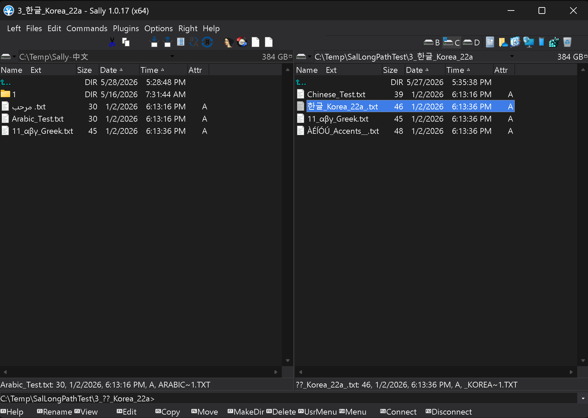
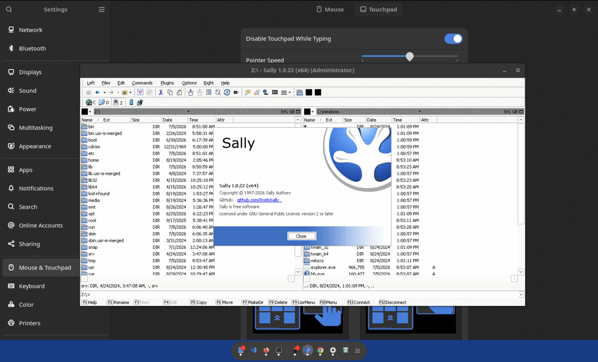

# Sally

[](https://github.com/0xeb/sally/releases)
[](https://github.com/0xeb/sally/actions)
[](https://github.com/0xeb/sally/stargazers)
[](LICENSE)

Sally is a fast, keyboard-first dual-panel file manager for Windows power users. It keeps the classic [Open Salamander](https://github.com/OpenSalamander/salamander) workflow alive and moves it forward for current machines: Unicode and long paths, dark mode, Windows Terminal integration, native ARM64, modern viewing, active plugin packaging, Wine compatibility, maintained language packs, and a real release pipeline.

**Download:** [latest release](https://github.com/0xeb/sally/releases/latest) | **Star:** [help Sally get discovered](https://github.com/0xeb/sally) | **Support:** [PayPal](https://paypal.me/EliasBachaalany) or [Buy Me a Coffee](https://buymeacoffee.com/0xeb)

<p align="center">
  
</p>

## Why Sally

Open Salamander became loved because it made serious file work feel direct: two panels, fast keyboard commands, rich viewers, archive handling, plugins, and a compact Win32 UI that stays out of the way. Sally preserves that muscle memory while removing the places where the original codebase was showing its age.

- **Built for real file names**: Unicode and Windows long paths work through copy, move, delete, rename, drag/drop, panel state, directory history, Find, viewers, editors, startup paths, and network/UNC navigation.
- **Classic workflow, current polish**: the dense dual-panel interface remains, now with `Light`, `Dark`, and `System` theme modes across the core UI and first-party plugins.
- **Small project, fast movement**: user reports have turned into fixes for ARM64 FTP, Unicode context menus, viewer edge cases, Windows 11 automation changes, network long paths, release packaging, and language packs.
- **Open and actively shipped**: runtime zips, symbols, translator workspaces, and x64/x86/ARM64 builds are published through GitHub Releases.
- **AI-assisted development velocity**: AI helps grind through modernization work, tests, translations, and release plumbing while the project stays open source and user-driven.

## Feature Highlights

### File Operations That Respect Modern Paths

Sally's biggest modernization effort is path correctness. A file manager is only trustworthy if it acts on the exact file you selected, even when that name is long, non-ASCII, on a network share, or outside the active Windows code page.

- Unicode filenames and Windows long paths up to 32,767 characters.
- Wide-path handling across copy, move, delete, rename, create directory, quick rename, F4 edit, Alt+F3 external view, drag/drop, shell paste, directory history, and panel refresh.
- Safer Find result actions: loaded result files are validated, re-statted, and guarded against lossy ANSI fallbacks before destructive or shell-backed operations.
- Long UNC and WSL-style network paths are handled in more viewer and file-operation paths.
- Non-ASCII install paths work for startup, language loading, `config.reg`, and crash reporter launch.
- Cancellable network/UNC path checks prevent unreachable saved paths from hanging startup.
- Ongoing hardening covers ADS streams, reparse points, recursive delete prompts, same-volume moves, and Unicode worker error reporting.

### Fast Find And Safer Results

Find is not just a dialog; it is part of the file-operation surface.

- Save and load Find results.
- Preserve Unicode `Look in` roots in saved presets.
- Filter results by all items, files, or folders.
- Keep full Unicode status paths internally before display ellipsizing.
- Refuse unsafe ANSI-backed actions when a Unicode row cannot round-trip cleanly.

### Dark Mode That Keeps The Classic UI

Sally adds early dark-mode support without turning the app into a different product.

- Configure it under `Options` > `Configuration...` > `Appearance` > `Theme` > `Mode`.
- Choose `Light`, `Dark`, or `System` to follow the Windows app theme.
- Windows High Contrast remains authoritative and disables custom dark painting.
- Recent releases polished common dialogs, Find controls, About, size results, file panels, and bundled plugin surfaces.

### Modern Viewing

The viewer stack has moved away from legacy Internet Explorer-era assumptions.

- WebView2-based Web Viewer replaces the old IE WebBrowser control.
- Markdown renders with images and GitHub-style CSS support.
- Web Viewer can handle HTML, Markdown, XML, SVG, PNG, and related preview workflows.
- BOM-marked UTF-8, UTF-16LE, and UTF-16BE text files open decoded in Auto/Text mode while Hex mode still shows raw bytes.
- Viewer fixes cover final-line navigation, decoded row clipping, Unicode windows, prompt ownership, and WebView2 process cleanup.

### Windows Terminal And Shell Integration

Sally meets the tools you already use instead of assuming a bare `cmd.exe`.

- **Preferred command shell**: Sally discovers **Windows Terminal** (`wt.exe`), reads its Stable, Preview, and unpackaged profiles, and builds a dynamic `Commands` > `Windows Terminal` submenu. Launch any profile — PowerShell, a WSL distribution, or Command Prompt — straight into the active panel's folder.
- **Set your default**: `Commands` > `Default Shell...` picks what the Command Shell action (`Num /`) opens — `%COMSPEC%`, the Terminal default, or a named profile — and remembers it. One-off profile launches never overwrite the saved default, and the submenu simply disappears when Windows Terminal is not installed.
- **Rich icon overlays**: version-control and cloud status badges from tools like TortoiseGit, TortoiseSVN, OneDrive, Dropbox, and Google Drive appear in the panels — and Sally can show more of them at once than Explorer's tighter overlay-handler limit allows.

### Bundled Plugins

Current Sally builds package a broad first-party plugin set instead of leaving users to assemble the basics.

- Archive and package tools: 7-Zip, ZIP, TAR, UnRAR, UnISO, UnARJ, UnCAB, UnCHM, UnLHA, UnMIME, UnOLE2, PAK, Split & Combine.
- File and system tools: FTP Client, File Comparator, Checksum, DiskMap, Registry Editor, Renamer, PE Viewer, Database Viewer, Network, Portable Devices, Windows Mobile.
- Viewer and automation tools: Web Viewer, Multimedia Viewer, Automation, Check Version.
- Plugin packaging now generates `plugins.ver`, resolves side-by-side plugin dependencies from plugin DLL directories, and auto-discovers newly shipped plugins for existing users.
- Legacy Altap Salamander 4.0 plugins are loaded only after user consent.

### Platforms, Releases, And Compatibility

Sally is not a one-off binary drop. The release machinery is part of the product.

- Runtime zips for x64, x86, and ARM64, including Windows on ARM.
- Separate debug-symbol zips for crash dump investigation.
- Translator workspace artifacts for localization contributors.
- GitHub release updater over HTTPS through the Check Version plugin.
- [Wine compatibility work](#running-on-linux-with-wine) makes Sally run under Wine (10.0 and newer) by avoiding hard dependency on `imageres.dll` and falling back to `shell32.dll` resources where needed.
- Modern CMake build covers Sally, bundled plugins, trace server, translator, shell extension, helper tools, language files, and release population.
- Clang-CL/xwin toolchains support Windows x64 and ARM64 cross-compilation with the MSVC ABI.

### Localization Is Alive

Sally ships 10 maintained UI languages across supported release packages:

Chinese (Simplified), Czech, Dutch, French, German, Hungarian, Romanian, Russian, Slovak, and Spanish.

The localization pipeline includes committed `.slt` archives, generated Translator workspaces, headless validation/export support, and release artifacts that make translation work possible without hidden legacy assets.

## Downloads

Pre-built binaries are available on the [Releases](https://github.com/0xeb/sally/releases) page.

- Pick `Sally-<version>-x64.zip` for most modern Intel/AMD Windows systems.
- Pick `Sally-<version>-ARM64.zip` for native Windows on ARM.
- Pick `Sally-<version>-x86.zip` for 32-bit systems.
- Download `Sally-<version>-pdb.zip` only if you need symbols for debugging.
- Download `Sally-<version>-translator-workspace.zip` if you want to help with language packs.

## Running on Linux with Wine

Sally is a native Windows application, but it runs well under
[Wine](https://www.winehq.org/) on Linux — no Windows and no virtual machine
required. The screenshot below is Sally on Ubuntu 24.04 (x64) under Wine.

<p align="center">
  
</p>

Grab an x64 runtime zip from the [Releases](https://github.com/0xeb/sally/releases)
page and launch it with `wine sally.exe`. Sally needs no .NET or Wine Mono/Gecko.
See the [Wine guide](doc/WINE.md) for install steps, a download/run walkthrough,
a launcher wrapper, and troubleshooting.

## Support Sally

If Sally saves you time, please [star the repository](https://github.com/0xeb/sally). Stars matter for discovery, especially for a small Windows desktop project that is doing a lot of unglamorous modernization work.

Financial support helps pay for the AI-assisted development workflow and keeps more time and tokens flowing into Sally:

- [Support via PayPal](https://paypal.me/EliasBachaalany)
- [Support via Buy Me a Coffee](https://buymeacoffee.com/0xeb)

Bug reports, focused testing, translation help, and careful feature requests are also valuable. Sally has moved fastest when users reported exact workflows and came back to verify the fix.

## Building

### Prerequisites

- [Visual Studio 2022](https://visualstudio.microsoft.com/downloads/) with the **Desktop development with C++** workload
- [Windows 11 SDK](https://developer.microsoft.com/en-us/windows/downloads/windows-sdk/) (10.0.26100 or newer)

### Build Commands

```bash
# Configure and build (x64 default)
cmake -S . -B build
cmake --build build --config RelWithDebInfo

# Populate output directory
cmake --build build --config RelWithDebInfo --target populate
```

Output: `build/out/sally/<Config>_<Arch>/`

When you run Sally from `build/out`, rebuild and repopulate that exact configuration first. For example, use `cmake --build build --config Release --target populate` before launching `build/out/sally/Release_x64/` so plugin DLLs and `.slg` language files stay in sync.

## Contributing

Contributions are welcome. See the [Developer Guide](doc/DEV.md) for repository structure, build targets, and internals.

If you want to help with UI translations and language packs, see the [Localization Guide](doc/LOCALIZATION.md).

Good issue reports include the Sally version, architecture, exact path or filename shape when relevant, steps to reproduce, and whether the bug happens with the latest release.

## About

Sally is an independent fork of [Open Salamander](https://github.com/OpenSalamander/salamander), maintained by [Elias Bachaalany](https://github.com/0xeb). The original Open Salamander authors are not responsible for this project and do not provide support for it. Development is AI-assisted using [Claude Code](https://docs.anthropic.com/en/docs/claude-code). See [Origin](doc/ORIGIN.md) for the full project history.

## License

Sally is a modified version of Open Salamander, open source software licensed under [GPLv2](LICENSE).

- Copyright © 1997-2023 Open Salamander Authors — see [doc/AUTHORS](doc/AUTHORS).
- Modifications © 2025-2026 Elias Bachaalany and Sally contributors — see [AUTHORS](AUTHORS).

Files throughout `src/` have been modified from their Open Salamander originals since 2025-10-17; see [NOTICE](NOTICE). Per-file provenance is recorded in SPDX headers, so a file derived from Open Salamander carries both copyright lines while a file written for Sally carries only the fork line.

Individual components and libraries have separate but compatible licenses, and some retain their individual authors' copyright; see [third_party.txt](doc/third_party.txt) for details.

## Resources

[Altap Website](https://www.altap.cz/) | [Features](https://www.altap.cz/salamander/features/) | [Documentation](https://www.altap.cz/salamander/help/) | [Community Forum](https://forum.altap.cz/) | [Upstream Repository](https://github.com/OpenSalamander/salamander) | [Wikipedia](https://en.wikipedia.org/wiki/Altap_Salamander)
